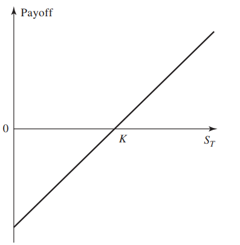
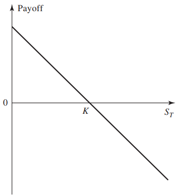

# Chapter Summary
----

## Market Types

### Exchange-traded markets
* A regulated exchange, provide a standardized contract to the market participants.

* Once two traders agreed the transcation, the exchange clearing house provide the clearing service to each party such that the credit risk can be reduced.
 
### Over-the-counter (OTC) markets
* Traditionally, once the trade is agreed, each party usually send the trade to centralized counterparty (CCP) for clearing or clear trade bilaterally.

* The regulations may not as strict as the exchange-traded market
---

## Introduction to Some Common Derivatives

### Forward Contracts and Future Contracts
* It is an obligation to buy or sell a certain asset at certain future time for a certain price.  

* The only difference between forward contract and a future is that:
  * Forward contract trade in OTC market
  * Future trade in exchanges

#### Payoff function
$S_k$ is the spot price of the asset at the maturity (expiry date), 

$K$ is the agreed delivery price
##### Long Position (Buy)
$$
    \text{payoff} = S_k - K
$$

##### Short Position (Sell)
$$
    \text{payoff} = K - S_k
$$

### Options
* It is a right to buy/sell an asset at a certain future time for a certain price
* It can be traded in both exchange and OTC market

#### Types of Options
* Amercian Options: It can be exercised at any time up to the expiry date
* European Options: It can only be exercised at the expiry date
  
---
## Types of Traders

### Hedgers
Using derivatives to reduce the risk from the movement of the market variable

### Speculators
Using derivatives to bet on the future price of the market

### Arbitrageurs
Using derivatives to lock in profit
