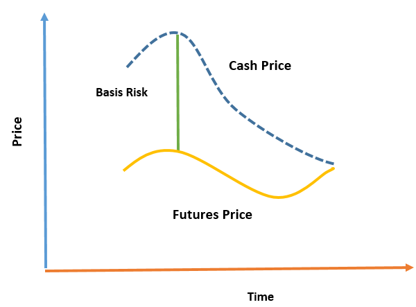

# Chapter 3 Summary
----
## Basic Idea of hedging
* Using financial instructment to neutralize the risk

* Long hedge: Taking the long position in futures contracts. It is suitable for the case that, the hedger wants to buy a particular asset in the future, as if the price goes up, the hedger can buy the asset in a lower price which stated in the future contract (lock in the cost). 
  
* Short hedge: Taking the short position in future contracts. It is suitable for the case that, the hedger wants to sell a particular asset in the future, as if the prices goes down, the hedger can sell the asset in a higher price which stated in the future contract (lock in the profit). 

----
## Basis Risk
Definition: 

$$
    \text{basis} = \text{spot price of the asset} - \text{price of the future contract}
$$

### Sources of basis risk
* Imperfect matching between the asset and hedge asset
* Maturity mismatch due to uncertain time for closing the hedge position

### Payoff
Definitions:
$$
    \text{$S^{*}_{t_2}$ and $S_{t_2}$ is the spot price of the asset of the hedge asset and the target asset at time $t_2$, } \\
    \text{$F^{*}_{t_1}$ and $F^{*}_{t_2}$ are the price of the future contract, which the underlying asset may/may not be the same, at time $t_1$ and $t_2$} \\
$$
By using hedging, the effective price of the asset will be paid/received can be described:
$$
    \text{price} = S_{t_2} + F^{*}_{t_1} - F^{*}_{t_2} 
$$

Exaplaination: 
The effective price = the spot price + profit/loss from the future contract

The effective price can also be re-written as the follows:

$$
   \text{price} = F^{*}_{t_1} + (S_{t_2} - S^{*}_{t_2}) + (S^{*}_{t_2} - F^{*}_{t_2} ) 
$$

Exaplaination: The last two terms are the source of basic risk
1. Price difference between the target asset and hedge asset
2. Maturity mismatch due to uncertain time for closing the hedge position

### General Rule of thumb for Choosing Future Contract
* Choose the contract with the delivery month that is as close as possible to, but later than the expiry month of the hedge contract, assuming there is sufficient liquidity in all contract to match the requirement.
  
----
## Analysis of Basic Hedging Strategy
Main goal: To determine how much to hedge, that is the number of contract needed:

Definitions:

$h^*$ is hedge ratio

$Q_A$ is the size of an unit of asset being hedge

$Q_F$ is the size of an unit of future contracts used for hedging

$V_A$ is the value of the asset being hedge = $Q_A$ * current spot price 

$V_F$ is the value of the asset being hedge = $Q_F$ * current future price 

\sigma_{S} is the variance of the change in spot price

\sigma_{F} is the variance of the change in future price

\rho is the correlation coefficient between the change in spot price and change in future price

The optimal number of contract is given by:
$$
    N^* = \frac{h^* Q_A}{Q_F}
$$

Explaination: If we don't consider the difference between the price of the asset being hedge and the asset underlying the future($h^*$ = 1), it is just simple division.

### The determination of the Hedge Ratio
When cross hedging is used (the asset being hedge $\neq$ the asset underlying the future contract), $h^* = 1$ is not suitable. We probably want to minimized the variance of the price of the underlying asset of the contract.

The minimum variance hedge ratio is defined, which derived from the linear regression of the change of spot price ($\Delta S$) of the asset with respect to the change of future price ($\Delta F$):
$$
   h^* = \rho \frac{\sigma_{S}}{\sigma_{F}}
$$

#### Using stock index future to hedge the equtiy price
In the case that we are confident about the portfolio, but uncertain about the market movement, we want to hedge the market movement such that the return of the portfolio almost only depends on the performance of the stock. In this case, we set $h^* = \beta$, which is the excess return of sensitivity of the portfolio to the market (captial asset pricing model).

If the $\beta$ of the portfolio is changed to $\beta^*$, the $h^*$ need to be adjust based on the following cases:

$$
  \text{case 1: $\beta^*$ > $\beta$, long position is required}, h^* = \beta - \beta^*
$$
$$
  \text{case 1: $\beta^*$ < $\beta$, short position is required}, h^* = \beta^* - \beta
$$

Explaination: If $\beta^*$ is higher, implies portfolio become more violatile compare to the market, so we want to be long position to accommodate the risk, that is buy more index future. Similiar argument for the case $\beta^*$ is smaller.

### Tailing the Hedge
It is natural to update the future position everyday with respect to the price changes everyday, therefore the optimal number of contract can be rewritten as:
$$
    N^* = \frac{h^* V_A}{V_F}
$$

